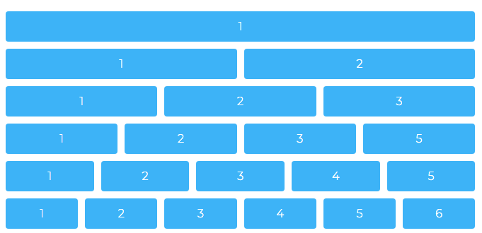

<p align="center"></p>

<h1 align="center"> 60 Columns Grid System  </h1>

<p align="center"> 60 Grid System is Starter Grid for the CSS Grid. </p>

<hr/>

What is 60 Grid System?

60 Grid System is Starter Grid for the CSS Grid.

It is just one CSS class.

Let me show you the code:

```css
.grid {
          display: grid;
          grid-template-columns: repeat(60, 1fr)
        }

```

This is it? You must be joking!? Is it some kind of dark magic?


I will show you it’s dark secrets in a minute. Just give me a chance to explain.

Why 60 columns?

60 is the first number that is dividable by 2,3,4,5 and 6.

So what?

This is the easiest way to make 1- 6 column grid with equal width using the CSS Grid.

I’m talking about this picture:

<a href="https://vladocar.github.io/60gs/"></a>

Hmm.. I’m sceptical about this?

Back in the day the 960px was the magic number and was dividable by 2,3,4,5 and 6. You all probably used 960px layout in the past.

60 Grid System does the same thing 1 - 6 columns by making 60 smaller units. Plus is flexible.

It will work with any width:

```css
.grid {
   width: 1237px / 83% / 40rem /* random numbers */
   display: grid;
   grid-template-columns: repeat(60, 1fr)
}
```
You can also add grid-gap:

```css
.grid {
   width: 1237px / 83% / 40rem /* random numbers */
   display: grid;
   grid-gap: 10px; /* random number */
   grid-template-columns: repeat(60, 1fr)
}
```

I don't get it? How you can add columns? I like to make my own semantic HTML5 friendly layout and I don't want to use any framework.

You can. Make your own id and classes.

I like layout with Header, Footer, Sidebar the classic style, how can I do that? 

Hmm, nobody does that anymore, but you are the boss.

You probably want something like this:

```css
#header, #footer { grid-column: 1 / 61 }
#sidebar {  grid-column: 1 / 17 }
#article { grid-column: 17 / 61 }
```

<a href="https://vladocar.github.io/60gs/60.html">Here is the demo</a>

I still don't understand  1 / 17 and 17 / 61 ?

Are you sure you know CSS Grid!? First go learn the CSS Grid and come back later.

Yeah I'm still learning Flexbox.. now CSS Grid. Life was easier back in the day.

I hear you, brother.

I'm back. So I can add my own custom columns with my own naming system?

Yes, absolutely.

I just need to specify the grid-column to go form 1 to 61, right?

Yes, exactly.

What about overlapping columns?

Overlapping columns .. ah you are that guy that watched the video about overlapping columns and you want to make multilayer posters with HTML and CSS. Sure you can do overlapping columns as well. Example (1 to 23 and 17 to 30…) just overlap the numbers.

I don't like to make header, footer ids. What are we 1996? Can me make something more modern like OOP CSS?

Finally some good questions. Yes we can!

With the CSS Grid we can merge columns like this:

```css
.col-30 { grid-column-end: span 30 }  /* 2 columns */
.col-20 { grid-column-end: span 20 } /* 3 columns */
```

```HTML
<div class=“col-30”> 50% </div>
<div class=“col-30”> 50% </div>

<div class=“col-30”> 33.33% </div>
<div class=“col-30”> 33.33% </div>
<div class=“col-30”> 33.33% </div>
```

Aha, so it is important to 30 + 30 = 60 meaning 50% and 50% column?

Yes.

Can I use Sass with this?

Yes I’ve build some Sass. Go check the 60gs.scss file.

Is it responsive?

It can be, I’ve made some basic responsiveness in the 60gs.css file and it is your task to add more features.

Now some hard questions: Can I have 7 identical columns in one row?

No. Who does 7 columns!? Not even Rick and Morty have 7 columns in their grid! And Rick is the smartest man in the universe.

But the designer made 7 column grid, I don’t know what to do?

Fire the designer.

But seriously, I need 7 columns?

Allllright..  .grid7{ grid-template-columns: repeat(7, 1fr) } .somename{grid-column-end: span 1} and put the grid7 inside the grid. Like Matrix or Inception.

What about 11 columns?

Do you know to play Russian Roulette .. play it for 11 times .. problem solved :)

I played it for 11 times can you now tell me the solution?

Hmm.. you lucky bas… Yes, you need to do the same thing like with the 7 columns.

Everyone was .. CSS Grid is the next big thing.. now I need to have 60 columns so I can have 6 columns?

There's more than one way to skin a cat, use the solution that works best for you.

What about browser compatibility?

First, know your customers. If your customers are people like me and you  don’t have a problem.. otherwise go with the flow ->  float.

So basically 60 gs is like the 960px grid but just for the CSS Grid?

Yes, but 60 gs can take any value not just 960px and is much more flexible and fluid plus is super easy to make your grid-gap.

Thanks, I'll probably stick with Flexbox.

P.S Ahh, You are still here. You are wondering where is the NPM command.. ahh sorry you prefer yarn. Didn't you read that npm is new yarn? Aha, you use web-pack lately. You can just copy paste, it's only one CSS class. 

Just kidding <a href="https://github.com/vladocar/npm-I-love-you-too">npm I love you too :)</a>

```shell
$ npm i 60gs
```

```html
 <link rel="stylesheet" href="https://unpkg.com/60gs@1.0.0/60gs.css">

or

 <link rel="stylesheet" href="https://unpkg.com/60gs@1.0.0/60gs-barebone.css">
```
